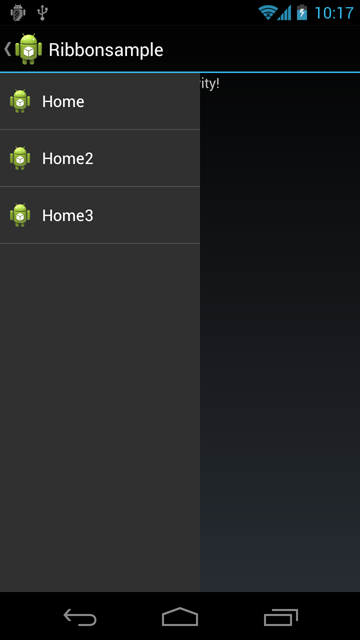
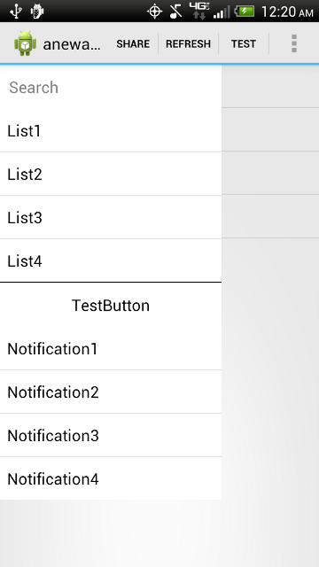
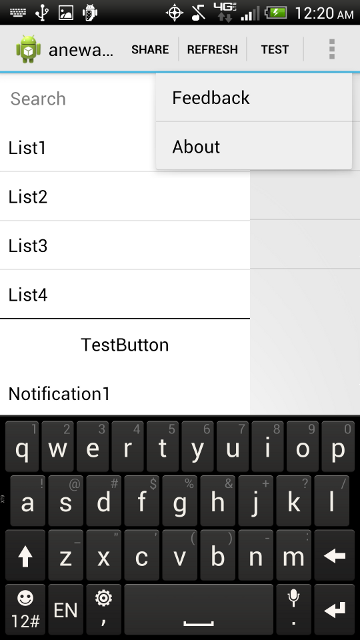

# New Ribbon Menu [Deprecated] 

Updated navigation menu for Android.

Original:

New:

Purpose
=====

- Ease of Access: Allow easy access to a menu that slides in and out
- Ease of Implementation: Update the same screen using minimal amount of code
- Customization: Easy to change colors and menus

New
=====

- Removed the 'library' project and condensed the project to one class
- Changed the sliding animation to match Facebook and Google+ apps
- Added standard ActionBar (you can chose to use ActionBarSherlock)
 - Used menuitem to open the Menu
- Added ability to update ListView on main Activity
- Added 2 ListViews to the Menu, similiar to Facebook and Google+ apps
- Added a AutoCompleteTextView and a Button as well to show examples of implemenation
- Added ability to allow users to hit the 'back button' to hide the menu when it is open
- Allows users to interact with background(main ListView) and the menu at the same time unlike the Facebook and Google+ apps

Future
====

- Swiping to open and close
